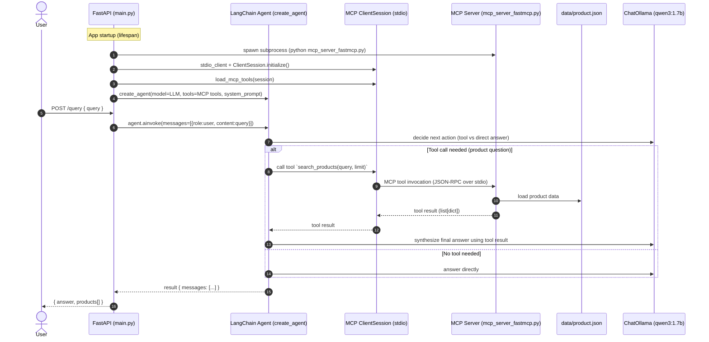
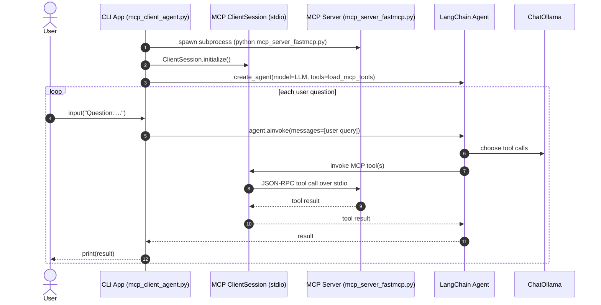
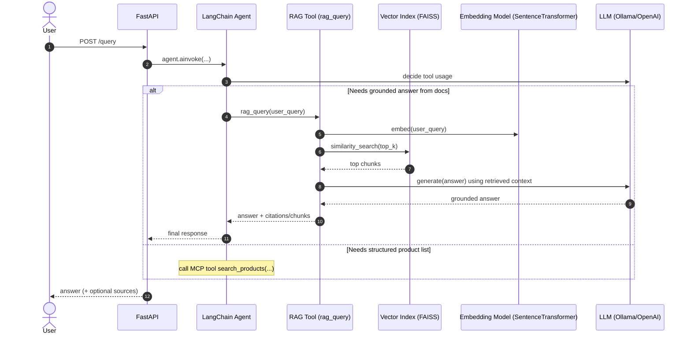

# RAG + MCP Agentic App (This Repo) — End-to-End Flow Guide

<!--
Dark-theme readability note:
- Many Markdown renderers do NOT allow forcing link colors.
- Cursor/IDE previews often do. If your preview supports CSS, this will make links visible.
- If it doesn't, prefer writing URLs as inline code: `https://...`
-->

You have **two main integration styles** in this repo:

- **HTTP API app**: `main.py` (FastAPI) runs a LangChain agent that calls tools served by an **MCP server** over **stdio**.
- **CLI app**: `mcp_client_agent.py` does the same thing but as a terminal loop.

This document explains the **complete pipeline flow** (with sequence diagrams), how **MCP client/server** fit together, how **RAG should fit** (and where it currently doesn’t), and what features to build next.

---

## What you have today (high-level architecture)

### Components

- **User**
  - Sends a question either via HTTP (`POST /query`) or CLI input.

- **MCP Client (inside your app)**
  - In `main.py` (FastAPI lifespan): uses `stdio_client(...)` + `ClientSession(...)` to connect to the MCP server process.
  - Loads MCP tools into LangChain via `langchain_mcp_adapters.tools.load_mcp_tools(session)`.

- **LangChain Agent**
  - Created in `main.py` via `create_agent(model=ChatOllama(...), tools=tools, system_prompt=...)`.
  - Decides which tool to call (example: `search_products`) and then produces a final answer.

- **MCP Server**
  - `mcp_server_fastmcp.py` defines tools with `FastMCP(...); @mcp.tool() ...`
  - Runs as a subprocess with `mcp.run(transport="stdio")`.

- **Product Data**
  - JSON lives at `data/product.json` and is used by both sides (FastAPI endpoint and MCP tool server).

---

## Sequence diagram: HTTP request → Agent → MCP tool → response

This is the **actual runtime path** for `POST /query` in `main.py`.

### Key code locations for this flow

- **FastAPI app + MCP client + agent**
  - `main.py` → `lifespan()` creates MCP session + agent
  - `main.py` → `POST /query` invokes agent and extracts tool outputs

- **MCP tools**
  - `mcp_server_fastmcp.py` → `@mcp.tool() search_products(...)`, `list_products(...)`, `get_product(...)`

---

## Sequence diagram: CLI → Agent → MCP tools

This is `mcp_client_agent.py`.

---

## Where “RAG pipeline” fits (conceptually)

In a RAG system, tool calls typically look like:

1. **Ingest** documents (product specs, PDFs, web pages, FAQs, etc.)
2. **Chunk** text
3. **Embed** chunks
4. Store in a **vector index**
5. At query time:
   - embed the user query
   - retrieve top-k chunks
   - build a prompt with retrieved context
   - generate an answer grounded in that context

You already have a basic RAG implementation in `app/embeddings.py` and `app/rag.py`, and a debug script `debug_rag.py`.

### Important: current state in *this repo*

- `main.py` explicitly instructs the agent to **use `search_products` for product questions**.
- The RAG code in `app/rag.py` is **not currently integrated** into the FastAPI agent toolset.

So, today your app is more accurately:

- **MCP tools + agent routing** for product search
- plus a **separate experimental RAG module** not yet production-wired

---

## Sequence diagram: “Ideal” RAG tool call inside the agent

This is the flow you likely want next: the agent can call a `rag_query` tool (either local tool or MCP-served tool), *in addition to* `search_products`.

---

## How MCP helps (simple mental model)

Think of MCP as **“tools over a standard protocol”**.

- Your **app** (agent runner) is the **MCP client**:
  - it connects to a server, discovers tools, and calls them.
  - `load_mcp_tools(session)` converts MCP tools into LangChain tools.

- Your **tool host process** is the **MCP server**:
  - it registers tools (Python functions) with schemas
  - it receives tool calls over stdio and returns JSON results

This gives you a clean separation:

- Agent logic stays in the app (FastAPI/CLI)
- Tools can evolve independently (new tools, new backends, permissions, etc.)

---

## Current repo notes (things you’ll want to fix soon)

### 1) `mcp_server_fastmcp.py` uses `DETAIL_DATA_PATH` but it’s not defined

In `load_products()` it reads:

- `products` from `PRODUCT_DATA_PATH`
- then tries to open `DETAIL_DATA_PATH` (undefined)

If that function is executed, you’ll get a `NameError`.

### 2) `app/rag.py` is syntactically broken (missing parentheses/indent)

Right now `rag_tool()` has an incomplete `"\n".join(...)` line and indentation issues.
So the RAG tool cannot reliably run as-is.

### 3) `app/llm.py` uses `requests` to call Ollama directly

But in `main.py` you use `ChatOllama` from LangChain.
Long-term you’ll probably want **one consistent LLM integration** (either LangChain everywhere, or direct HTTP everywhere).

### 4) `app/calculator.py` uses `eval()`

That’s unsafe for untrusted input. In an agentic system, this is a common security footgun.

---

## Recommended “next implementation step” (practical path)

If your goal is: **“RAG-based Agentic app with MCP tools”**, the clean next step is:

- Keep `search_products` as your **structured product tool** (good for price/stock lists).
- Add a `rag_query` tool for **unstructured knowledge** (FAQs, policies, long specs, PDFs, manuals).

### Two good ways to add `rag_query`

- **Option A (simpler)**: local tool (inside FastAPI app)
  - Pro: fewer moving parts
  - Con: tool isn’t reusable outside this app

- **Option B (more MCP-native)**: RAG tool served by MCP server
  - Pro: tool reusable from any agent/app
  - Con: need persistent index lifecycle (load/build at startup, handle latency)

---

## Feature ideas to enhance this project (prioritized backlog)

### Tier 1 (high impact, low-medium effort)

- **Fix MCP server product loading**
  - remove/define `DETAIL_DATA_PATH` and ensure tools work reliably
- **Add “sources/citations” in API responses**
  - return `retrieved_chunks` or product IDs used
- **Add tool routing rules**
  - when to use `search_products` vs `rag_query`
- **Add basic conversation memory**
  - store last N turns and pass to agent (or to `rag_query`)

### Tier 2 (bigger capability jump)

- **Hybrid retrieval**
  - combine keyword filtering + vector similarity (better than pure embeddings)
- **Query rewriting**
  - “phones with 8 gb under 20k” → normalize constraints and units
- **Agent evaluation harness**
  - canned questions + expected outputs; run as CI
- **Caching**
  - cache `search_products` results; cache embeddings for repeated queries

### Tier 3 (production-quality)

- **Streaming responses** for `/query`
- **Observability**
  - request IDs, tool timing, token usage, tool error logs
- **Guardrails**
  - tool allow/deny list, rate limits, and safe math (remove `eval`)
- **Multi-tool plans**
  - “compare top 3 options” → search → rank → format → return

---

## Quick “how to run” (typical dev loop)

### Run the API

- Start the FastAPI app (example):
  - `uvicorn main:app --reload --port 8000`
- Call:
  - `GET /health`
  - `POST /query` with JSON: `{ "query": "phones with 8GB RAM" }`

### Run the CLI

- `python mcp_client_agent.py`

---

## Glossary (short)

- **MCP client**: your app’s connection to a tool server (`ClientSession`)
- **MCP server**: a process that hosts tools (`FastMCP`) and exposes them via protocol
- **Tool**: a function the agent can call (e.g. `search_products`)
- **RAG**: retrieve relevant text chunks + generate grounded answer from those chunks

