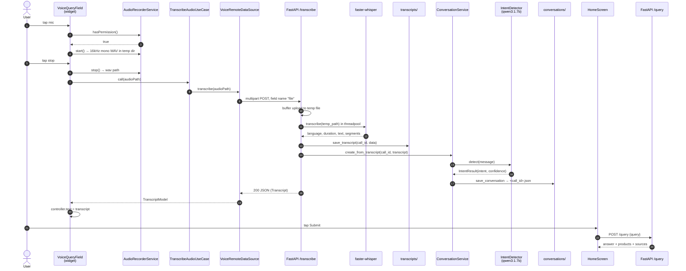

# Voice Transcribe Flow — Flutter → FastAPI → Whisper → Intent → RAG/MCP

End-to-end trace of a voice query: from the user tapping the mic in the Flutter
app, through `POST /transcribe` (which transcribes, classifies intent, and
records the conversation), and on into the `POST /query` agent pipeline.

Two repositories are involved:

| Repo | Role |
|---|---|
| `flutter-ecommerce-demo` | Records audio, uploads it, renders the transcript and results |
| `ecommerce-mcp-rag-agent` | FastAPI service: Whisper transcription + LangChain/MCP/RAG agent |

---

## 1. High-level sequence



---

## 2. Flutter side — layer by layer

Clean-architecture split: **presentation → domain → data**. The domain layer
knows nothing about HTTP.

### 2.1 Entry point — HomeScreen

[`HomeScreen.dart:256`](../flutter-ecommerce-demo/lib/presenation/screen/HomeScreen.dart#L256)
opens the "AI Ask Assistant" dialog. The dialog body is a `VoiceQueryField`
bound to a `TextEditingController`; the **Submit** button reads whatever text
ended up in that controller — typed or spoken.

```dart
content: VoiceQueryField(controller: queryController),
...
onPressed: () => _handleQuerySubmit(queryController.text),
```

The controller is the seam between the two halves of the feature: transcription
writes into it, submission reads out of it.

### 2.2 VoiceQueryField — the state machine

[`VoiceQueryField.dart`](../flutter-ecommerce-demo/lib/presenation/widget/VoiceQueryField.dart)

```
idle ──tap mic──▶ recording ──tap stop──▶ transcribing ──▶ done
  ▲                                             │
  └──────────────── error ◀────────────────────┘
```

`VoiceQueryStatus` ([line 10](../flutter-ecommerce-demo/lib/presenation/widget/VoiceQueryField.dart#L10))
drives both the icon and the status line. Key transitions:

| Step | Code | Notes |
|---|---|---|
| Dependencies built | [L46-48](../flutter-ecommerce-demo/lib/presenation/widget/VoiceQueryField.dart#L46-L48) | Falls back to `TranscribeAudioUseCase(VoiceRepositoryImpl(VoiceRemoteDataSource()))` when nothing is injected — injection exists for tests |
| Mic tap routing | [L59-68](../flutter-ecommerce-demo/lib/presenation/widget/VoiceQueryField.dart#L59-L68) | Taps are ignored while `transcribing`, so a double-tap cannot fire two uploads |
| Permission gate | [L71](../flutter-ecommerce-demo/lib/presenation/widget/VoiceQueryField.dart#L71) | First call triggers the OS prompt |
| Stop + upload | [L97-135](../flutter-ecommerce-demo/lib/presenation/widget/VoiceQueryField.dart#L97-L135) | 120 s timeout; `finally` always deletes the local WAV |
| Empty-audio guard | [L115](../flutter-ecommerce-demo/lib/presenation/widget/VoiceQueryField.dart#L115) | Whisper returns 200 with an empty string when it heard nothing — treated as an error state, not success |
| Hand-off | [L123](../flutter-ecommerce-demo/lib/presenation/widget/VoiceQueryField.dart#L123) | `widget.controller.text = transcript.transcript` |

### 2.3 AudioRecorderService — capture

[`AudioRecorderService.dart`](../flutter-ecommerce-demo/lib/data/service/AudioRecorderService.dart)

Wraps `package:record` and pins the format at
[L11-15](../flutter-ecommerce-demo/lib/data/service/AudioRecorderService.dart#L11-L15):

```dart
RecordConfig(encoder: AudioEncoder.wav, sampleRate: 16000, numChannels: 1)
```

16 kHz mono is what Whisper resamples to internally, so recording in that shape
keeps the upload small and skips a server-side conversion. Files land in
`getTemporaryDirectory()` as `voice_query_<epochMillis>.wav`.

`deleteRecording` swallows `FileSystemException` — a stray temp file is
harmless, and losing the transcript to a cleanup error would not be.

### 2.4 Domain layer

Two tiny files that keep the widget independent of HTTP:

- [`VoiceRepository.dart`](../flutter-ecommerce-demo/lib/domain/repository/VoiceRepository.dart) — abstract `Future<Transcript> transcribe(String audioPath)`
- [`TranscribeAudioUseCase.dart`](../flutter-ecommerce-demo/lib/domain/usecase/TranscribeAudioUseCase.dart) — callable class delegating to the repository

[`Transcript.dart`](../flutter-ecommerce-demo/lib/domain/entity/Transcript.dart)
is the entity, with `bool get isEmpty => transcript.trim().isEmpty`
([L28](../flutter-ecommerce-demo/lib/domain/entity/Transcript.dart#L28)) — the
check the widget uses at L115.

### 2.5 Data layer — the HTTP call

[`VoiceRepositoryImpl.dart`](../flutter-ecommerce-demo/lib/data/repository/VoiceRepositoryImpl.dart)
is a pass-through. The real work is in
[`VoiceRemoteDataSource.dart`](../flutter-ecommerce-demo/lib/data/datasource/VoiceRemoteDataSource.dart):

```dart
baseUrl = '${baseUrl ?? ApiConfig.ai_GatewayUrl}/transcribe';   // L14

final request = http.MultipartRequest('POST', Uri.parse(baseUrl))
  // The field name must stay `file` — it maps to `file: UploadFile` in FastAPI.
  ..files.add(await http.MultipartFile.fromPath('file', audioPath));  // L17-19
```

> **The multipart field name `file` is a hard contract.** It must match the
> parameter name in `async def transcribe_audio(file: UploadFile)`
> ([main.py:276](main.py#L276)). Rename either side and FastAPI returns 422.

[`TranscriptModel.fromJson`](../flutter-ecommerce-demo/lib/data/model/TranscriptModel.dart#L29)
parses the response defensively — every field has a fallback (`'unknown'`, `0`,
`''`, `[]`), so a partial payload degrades instead of throwing.

### 2.6 Host resolution

[`ApiConfig.dart`](../flutter-ecommerce-demo/lib/data/config/ApiConfig.dart)
resolves the base URL, and this is the most common source of "it works on the
emulator but not on my phone":

| Target | Host | How |
|---|---|---|
| Explicit override | whatever you pass | `--dart-define=API_HOST=10.1.196.114` |
| Web | `localhost` | `kIsWeb` |
| Android emulator | `10.0.2.2` | default, maps to host loopback |
| iOS simulator / other | `127.0.0.1` | default |

`ai_GatewayUrl` is port **8000** ([L36](../flutter-ecommerce-demo/lib/data/config/ApiConfig.dart#L36))
— the FastAPI agent directly. The separate `gatewayUrl` (8090) is the normal
product API and is not used by the voice flow.

**A physical device must be given `--dart-define=API_HOST=<your LAN IP>`.** The
`10.0.2.2` default is emulator-only and will silently fail on real hardware.

### 2.7 Android permissions

[`AndroidManifest.xml`](../flutter-ecommerce-demo/android/app/src/main/AndroidManifest.xml)
declares `RECORD_AUDIO`, `INTERNET`, and `ACCESS_NETWORK_STATE`. `RECORD_AUDIO`
is a runtime permission — `_recorder.hasPermission()` triggers the dialog.

---

## 3. FastAPI side — `POST /transcribe`

[`main.py:275-302`](main.py#L275-L302)

```python
@app.post("/transcribe", response_model=Transcript)
async def transcribe_audio(file: UploadFile) -> Transcript:
    audio = await file.read()
    if not audio:
        raise HTTPException(status_code=400, detail="audio file must not be empty")

    call_id = uuid.uuid4().hex
    suffix = Path(file.filename or "").suffix or ".wav"

    # Whisper reads from disk, so buffer the upload to a temp file first.
    handle, temp_path = tempfile.mkstemp(suffix=suffix)
    try:
        with os.fdopen(handle, "wb") as temp_file:
            temp_file.write(audio)

        # Decoding is blocking CPU work; keep it off the event loop.
        transcript = await run_in_threadpool(transcribe, temp_path)
    finally:
        os.unlink(temp_path)

    await run_in_threadpool(save_transcript, call_id, transcript)

    # Whisper returns 200 with an empty transcript when it heard nothing; there
    # is no conversation to record in that case.
    if transcript["transcript"].strip():
        await conversation_service.create_from_transcript(call_id, transcript)

    return Transcript(**transcript)
```

Five things worth knowing:

1. **Temp-file round-trip is mandatory.** `faster-whisper` takes a path, not
   bytes. The `finally` guarantees cleanup even if decoding raises.
2. **`run_in_threadpool` is not optional.** Whisper decode is blocking CPU work;
   calling it directly would stall the event loop and freeze every other request
   for the duration.
3. **`response_model=Transcript`** makes Pydantic the schema gate — a shape
   mismatch surfaces as a 500 here rather than a parse error in Dart.
4. **`call_id` never reaches the client.** It names both the transcript folder
   and the conversation file, so correlating a client-side failure with what
   was saved means matching on timestamp.
5. **The conversation stage is inside the request.** The intent LLM call runs
   before the response is returned, so it is on the client's critical path —
   see [§4.4](#44-latency-the-intent-call-is-on-the-critical-path).

### 3.1 Whisper transcription

[`app/voice/whisper_service.py`](app/voice/whisper_service.py)

```python
MODEL_SIZE = os.getenv("WHISPER_MODEL", "base")
_model = WhisperModel(MODEL_SIZE, device="cpu", compute_type="int8")
```

- The model is a **lazily-initialised module-level singleton**
  ([L10-19](app/voice/whisper_service.py#L10-L19)). The very first request after
  a server start downloads weights and can take minutes — later ones are fast.
  This is the usual reason the Flutter 120 s timeout trips exactly once.
- `segments` is a **generator**; the `for` loop at
  [L29](app/voice/whisper_service.py#L29) is what actually performs the decode.
- `speaker` is hardcoded to `"unknown"` — `faster-whisper` has no diarization.
- CPU + `int8` keeps it laptop-friendly at some accuracy cost.

Returned dict:

```python
{"language": ..., "duration": ..., "transcript": ..., "segments": [...]}
```

### 3.2 Persistence

[`app/voice/transcript_generator.py`](app/voice/transcript_generator.py) writes
`transcripts/<call_id>/transcript.json`, pretty-printed with
`ensure_ascii=False` so non-English transcripts stay readable.

### 3.3 Response contract

[`app/voice/model.py`](app/voice/model.py) ⇄
[`TranscriptModel.dart`](../flutter-ecommerce-demo/lib/data/model/TranscriptModel.dart)

```json
{
  "language": "en",
  "duration": 3.42,
  "transcript": "show me phones with 8 gb ram",
  "segments": [
    { "speaker": "unknown", "start": 0.0, "end": 3.42, "text": "show me phones with 8 gb ram" }
  ]
}
```

| Field | Python | Dart | Notes |
|---|---|---|---|
| `language` | `str` | `String` | Whisper's auto-detected language |
| `duration` | `float` | `double` | Seconds, rounded to 2 dp |
| `transcript` | `str` | `String` | Segment texts joined with a space |
| `segments` | `list[TranscriptSegment]` | `List<TranscriptSegment>` | Defaults to `[]` in Dart |

---

## 4. Conversation + intent

Everything under `app/conversation/`. The transcript is a record of *what was
said*; the conversation record is what the system *makes of it*.

```
transcript dict ──▶ parser ──▶ message + language
                                   │
                                   ▼
                            IntentDetector ──▶ IntentResult(intent, confidence)
                                   │
                                   ▼
                             Conversation ──▶ conversations/<call_id>.json
```

### 4.1 Parser — transcript dict → fields

[`parser.py`](app/conversation/parser.py)

`transcript["transcript"]` is already the joined segment text, so
[`message_from_transcript`](app/conversation/parser.py#L6) normally just strips
it. The fallback re-joins `segments` if that key is missing or blank — the same
defensive posture as `TranscriptModel.fromJson` on the Dart side.
[`language_from_transcript`](app/conversation/parser.py#L25) defaults to
`"unknown"` rather than an empty string.

### 4.2 IntentDetector — classification

[`intent_detector.py`](app/conversation/intent_detector.py)

A single `qwen3:1.7b` call at `temperature=0`, prompted to return only JSON.
The ten intents live in
[`IntentType`](app/conversation/intent_models.py#L6), and the prompt's intent
list is generated from that enum
([L19](app/conversation/intent_detector.py#L19)) — add an intent in one place
and both the prompt and validation follow.

**Never trust the raw response.** `qwen3` is a reasoning model: it can emit a
`<think>` block before the answer and fence the JSON. Parsing
`response.content` directly with `model_validate_json` fails on both.
[`parse_intent_response`](app/conversation/intent_detector.py#L34) handles it:

| Model returns | Handling |
|---|---|
| `<think>…</think>` then JSON | think block stripped ([L16](app/conversation/intent_detector.py#L16)) |
| ` ```json ` fenced | first `{…}` extracted by regex ([L17](app/conversation/intent_detector.py#L17)) |
| `"confidence": 95` | clamped to `1.0` — the intent is still worth keeping |
| intent outside the enum | `GENERAL_INQUIRY`, confidence `0.0` |
| prose, no JSON at all | `GENERAL_INQUIRY`, confidence `0.0` |
| Ollama down / model not pulled | caught at [L82](app/conversation/intent_detector.py#L82), same fallback |

Every path falls back to
[`UNKNOWN_INTENT`](app/conversation/intent_models.py#L31) and logs, rather than
raising. A misclassified message is recoverable downstream; a 500 that loses an
otherwise-good transcription is not.

`detect` also prints the message, the raw output, and the parsed result
([L93-95](app/conversation/intent_detector.py#L93-L95)). `print`, not
`logger.info`, because uvicorn configures only its own loggers — an app-level
INFO record reaches no handler and vanishes silently. This is debug
scaffolding; drop it or downgrade it when you no longer need it.

```
[intent] message : 'Lava Edge 50'
[intent] raw     : '{"intent": "PRODUCT_SEARCH", "confidence": 0.95}'
[intent] parsed  : IntentResult(intent=<IntentType.PRODUCT_SEARCH: 'PRODUCT_SEARCH'>, confidence=0.95)
```

### 4.3 Persistence

[`storage.py`](app/conversation/storage.py) writes
`conversations/<call_id>.json` — a **top-level folder**, not a file inside
`transcripts/<call_id>/`. The shared `call_id` is what links the two:

```
transcripts/496bab0693564a89b2be7de22c5b470e/transcript.json
conversations/496bab0693564a89b2be7de22c5b470e.json
```

Both directories are gitignored — they are generated output.
`model_dump(mode="json")` converts the datetime to an ISO string before
`json.dump` sees it; `IntentType` is a `str` enum so it serializes as a plain
string.

```json
{
    "conversation_id": "66f8bd44-37ca-45a1-971c-dae5d7e138c2",
    "channel": "voice",
    "customer_id": null,
    "message": "Lava Edge 50",
    "language": "en",
    "intent": "PRODUCT_SEARCH",
    "confidence": 0.95,
    "timestamp": "2026-08-11T10:58:05.474205Z"
}
```

`conversation_id` is fresh per record and unrelated to `call_id`. `channel` is
`"voice"` on this path; it exists so a future chat entry point can write the
same record type. `customer_id` is always `null` today — nothing in the flow
carries a user identity yet.

### 4.4 Latency: the intent call is on the critical path

`create_from_transcript` is awaited *before* `/transcribe` returns, so the
client waits for Whisper **and** an LLM round-trip. That is a second model
inference added to a request the Flutter side already guards with a 120 s
timeout.

It is ordered this way deliberately — the record is written before the response,
so a client that dies mid-flight still leaves a durable trace. If transcription
latency becomes a problem, the fix is a `BackgroundTask` rather than dropping
the stage: the client does not consume the intent today, so nothing downstream
needs it synchronously.

### 4.5 Timestamps

`datetime.now(timezone.utc)`, not `datetime.now()`. These records are persisted
and compared across machines, so a naive local timestamp would be ambiguous.

---

## 5. What happens after the transcript

Transcription only fills the text box. Submitting is a **second, separate HTTP
call** — nothing is chained automatically.

1. `_handleQuerySubmit` ([`HomeScreen.dart:281`](../flutter-ecommerce-demo/lib/presenation/screen/HomeScreen.dart#L281)) rejects blank input and shows a loading dialog.
2. [`ApiService.fetchRagResponse`](../flutter-ecommerce-demo/lib/data/service/ApiService.dart#L8) posts `{"query": ...}` to `/query`, again with a 120 s timeout.
3. The `/query` endpoint ([`main.py:245`](main.py#L245)) runs the LangChain agent at [`main.py:250`](main.py#L250).
4. The agent picks a tool: **`search_products`** (MCP, over stdio) for catalog questions, or **`rag_query`** ([main.py:181-208](main.py#L181-L208)) for policy/spec questions answered from the FAISS index.
5. [`extract_products`](main.py#L57), [`extract_rag_sources`](main.py#L95) and [`build_answer`](main.py#L141) shape the reply into `{query, answer, products, sources}`.
6. The app shows the products in a bottom sheet; the AI answer text is not rendered.

> **The detected intent does not route anything yet.** `/query` still lets the
> agent choose its own tool from the system prompt
> ([main.py:213-219](main.py#L213-L219)); it never reads
> `conversations/<call_id>.json`, and the two endpoints share no state. So a
> message classified `ORDER_TRACKING` still goes to `search_products` or
> `rag_query` like any other. The intent is recorded, not yet acted on —
> wiring it to a branch (RAG / Order API / Return API) is the next step.

See [`RAG_MCP_PIPELINE_FLOW.md`](RAG_MCP_PIPELINE_FLOW.md) for the agent internals.

---

## 6. Running the flow

**Backend** (must be up before the app):

```bash
cd ecommerce-mcp-rag-agent
uv run uvicorn main:app --host 0.0.0.0 --port 8000
```

`--host 0.0.0.0` is required for a physical device — binding to `127.0.0.1`
makes the server unreachable from the phone. Startup also boots the MCP
subprocess and builds the FAISS index
([lifespan, main.py:155-221](main.py#L155-L221)), so wait for
`Application startup complete`. Ollama must be running with `qwen3:1.7b` —
now used by **both** the agent and the intent detector, so a missing model
breaks classification as well as `/query`.

**App**:

```bash
cd flutter-ecommerce-demo
flutter run -d <device-id> --dart-define=API_HOST=<your-mac-lan-ip>
```

Find the IP with `ipconfig getifaddr en0` (or `en1` on Wi-Fi). Phone and Mac
must be on the same network.

---

## 7. Debugging — where to put breakpoints

Set these to prove the chain end to end. If a breakpoint is skipped, the failure
is *upstream* of it.

| # | File | Line | Fires when |
|---|---|---|---|
| 1 | [`AudioRecorderService.dart`](../flutter-ecommerce-demo/lib/data/service/AudioRecorderService.dart#L34) | 34 | Recording starts |
| 2 | [`VoiceQueryField.dart`](../flutter-ecommerce-demo/lib/presenation/widget/VoiceQueryField.dart#L102) | 102 | Recording stopped, path returned |
| 3 | [`VoiceRemoteDataSource.dart`](../flutter-ecommerce-demo/lib/data/datasource/VoiceRemoteDataSource.dart#L17) | 17 | Multipart request built |
| 4 | [`main.py`](main.py#L277) | 277 | **Server received the upload** |
| 5 | [`whisper_service.py`](app/voice/whisper_service.py#L23) | 23 | Decode begins |
| 6 | [`main.py`](main.py#L295) | 295 | Transcript about to be saved |
| 7 | [`main.py`](main.py#L300) | 300 | Conversation stage entered |
| 8 | [`intent_detector.py`](app/conversation/intent_detector.py#L81) | 81 | Intent LLM call about to fire |
| 9 | [`intent_detector.py`](app/conversation/intent_detector.py#L34) | 34 | Raw model output, pre-parse |
| 10 | [`conversation_service.py`](app/conversation/conversation_service.py#L54) | 54 | Record about to be written |
| 11 | [`TranscriptModel.dart`](../flutter-ecommerce-demo/lib/data/model/TranscriptModel.dart#L29) | 29 | Response parsed |
| 12 | [`main.py`](main.py#L250) | 250 | Agent invoked (after Submit) |

**3 hits but 4 doesn't → networking**, not code: wrong `API_HOST`, server bound
to loopback, or a firewall.

**7 hits but 8 doesn't** → the transcript was empty, so the conversation stage
was skipped by the guard at [main.py:299](main.py#L299).

For intent problems specifically, breakpoint 9 is the one that matters — inspect
the `content` argument. The `[intent] raw` print gives you the same string
without stopping the server.

### Prerequisites for breakpoints to bind at all

- **Python**: launch via VS Code **Run and Debug → FastAPI: uvicorn (debug)**
  ([`.vscode/launch.json`](.vscode/launch.json)). A server started with plain
  `uv run uvicorn …` in a terminal has no debugger attached and will never stop.
  Never add `--reload` to the debug config — the reloader runs the app in a
  child process the debugger is not attached to, which silently disables every
  breakpoint.
- **Flutter**: launch via **Run and Debug**, not `flutter run` in a terminal.
  Only VS Code's own session binds breakpoints, and only in debug mode (not
  profile/release). Run one session at a time — a stray terminal `flutter run`
  will take over the device.
- **`mcp_server_fastmcp.py` breakpoints never hit.**
  [main.py:158-162](main.py#L158-L162) spawns it as a **stdio subprocess** via
  `sys.executable`, outside the debugger. Use the *attach* config with
  `debugpy.listen(5678)` at the top of that file, or test it directly with
  [`test_mcp_tools.py`](test_mcp_tools.py).

### Testing the intent detector without the app

It needs no audio and no running server:

```bash
uv run python -c "
import asyncio
from app.conversation.intent_detector import IntentDetector
asyncio.run(IntentDetector().detect('where is my order 12345'))
"
```

The `[intent]` prints show the raw output and the parsed result. To replay a
saved transcript through the whole conversation stage, pass its `call_id` to
`ConversationService().create_from_transcript`.

---

## 8. Failure modes

| Symptom | Cause | Fix |
|---|---|---|
| "Microphone permission denied" | `RECORD_AUDIO` refused | Grant in system settings; reinstall to re-prompt |
| "No audio was captured" | `stop()` returned null | Recording never started — check the permission gate |
| "Couldn't hear anything" | 200 OK, empty transcript | Silence or mic too far; `isEmpty` guard at L115 |
| Transcription times out first try | Whisper weights downloading | Expected once per fresh install; retry |
| Timeout every time | Wrong `API_HOST` or server on `127.0.0.1` | `--dart-define=API_HOST=<LAN IP>`, serve on `0.0.0.0` |
| `422 Unprocessable Entity` | Multipart field not named `file` | Must match `file: UploadFile` |
| `400 audio file must not be empty` | Zero-byte upload | Check the WAV exists before upload |
| `/query` returns no products | Agent chose `rag_query` | Product wording is steered by the system prompt at [main.py:213-219](main.py#L213-L219) |
| No file in `conversations/` | Transcript was empty | Guard at [main.py:299](main.py#L299); fix the audio, not the record |
| Every intent is `GENERAL_INQUIRY` / `0.0` | Fallback firing every time | Check the `[intent] raw` print — Ollama down, `qwen3:1.7b` not pulled, or output the regex can't match |
| Intent is plausible but wrong | Genuine misclassification | Prompt/enum at [intent_models.py:6](app/conversation/intent_models.py#L6); `confidence` shows how sure the model was |
| `/transcribe` slower than before | Intent call is in-request | Expected — see [§4.4](#44-latency-the-intent-call-is-on-the-critical-path) |
| Routing ignores the intent | No routing exists yet | Intent is recorded only; `/query` still self-selects its tool |
